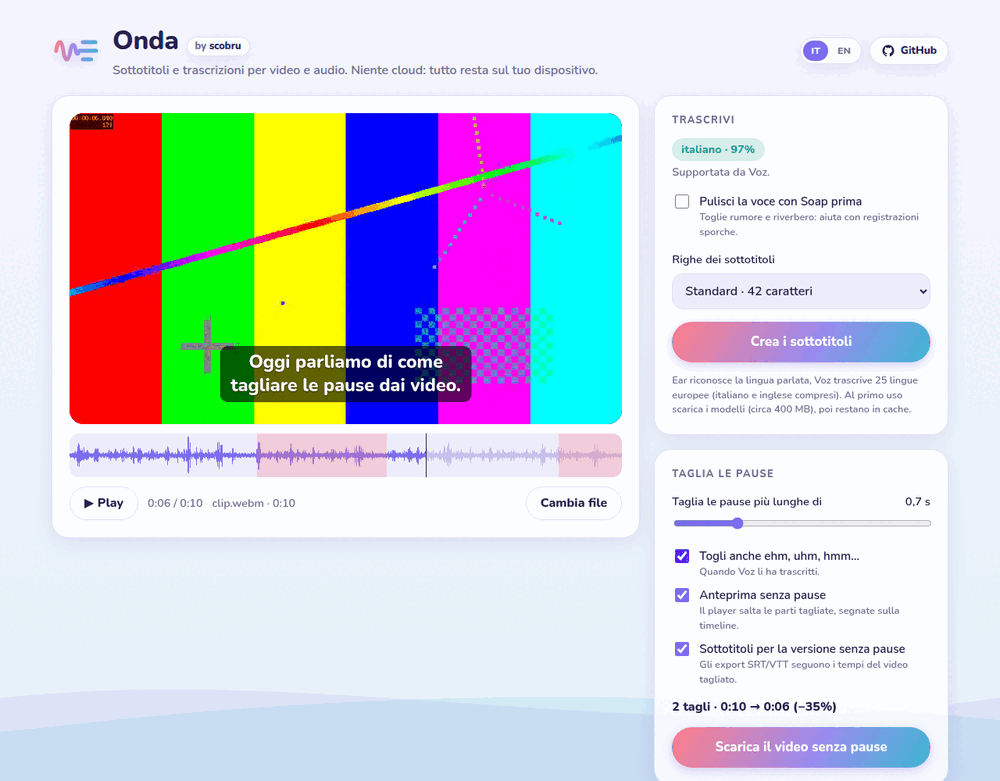

<p align="center"></p>

<h1 align="center">Onda</h1>

<p align="center"><b>Subtitles and transcripts for video and audio</b>, in the browser and without the cloud.</p>

<p align="center"></p>

Drop a video (or an audio file), and Onda writes its subtitles: you watch them
over the video, fix them in place and export them. Everything runs on your
device with small models from [Desert Ant Labs](https://desertant.com); nothing
is uploaded.

| Step | Model | What it does |
|---|---|---|
| Language | [Ear](https://desertant.com/models/ear/) | Recognizes the spoken language (99 languages) and stops before a transcript Voz can't do |
| Clean-up (optional) | [Clear](https://desertant.com/models/clear/) | Removes noise and reverb before transcribing, as in [Soap](https://github.com/scobru/soap) |
| Transcript | [Voz](https://desertant.com/models/voz/) | Speech to text with word timestamps, 25 European languages |
| Jump cuts | Voz's timestamps | Cuts the pauses (and "uh", "um") out of the video, rendered in the browser |

## Use it

1. **Load** a video (MP4, MOV, WebM, MKV, …) or an audio file, or record from the microphone. Audio files play over an "audiogram" card.
2. **Create subtitles**: Ear names the language, Clear optionally cleans the voice, Voz transcribes.
   - If Ear hears a language Voz doesn't cover (Japanese, for example), Onda says so and waits: *Transcribe anyway* goes ahead.
3. **Watch and fix**:
   - The current subtitle is drawn over the video, and the list highlights it.
   - Click a time to jump there, and type straight into any subtitle.
   - Lines are at most 42 characters, or 32 for vertical social videos, two per subtitle.
4. **Export** SRT, WebVTT or plain text. Exports always include your edits.
5. **Cut the pauses**:
   - Silences longer than a threshold (0.3–2 s, 0.7 s by default) are cut, with a little air left around the speech.
   - Filler words can go too, when Voz has transcribed them.
   - The preview skips the cuts, which are marked on the timeline.
   - *Download the video without pauses* renders the edit in the browser (WebCodecs, via [Mediabunny](https://mediabunny.dev)): MP4 with H.264/AAC where the browser can encode them, otherwise VP9/Opus.
   - The SRT/VTT exports can follow the cut timing, so the subtitles match the new video.

The interface is in Italian and English; it follows the browser language and has a switch.

## Develop

```bash
npm install
npm run dev      # http://localhost:5173
npm test         # subtitle cues and SRT/VTT/TXT
npm run build    # static site in dist/
```

- The audio is decoded once at 16 kHz mono (what Ear and Voz listen at), so long videos stay light in memory; the video itself plays from the original file.
- **Ear** and **Clear** run on LiteRT.js (WebAssembly, or WebGPU on request). The runtime is served from your own origin (`scripts/copy-litert.mjs`). For its multi-threaded build the host must send `Cross-Origin-Opener-Policy: same-origin` and `Cross-Origin-Embedder-Policy: credentialless` (the Vite servers and `vercel.json` do).
- **Voz** runs on ONNX Runtime Web: WebGPU for the encoder, WebNN for the decode step where the browser has it, and the CPU on a machine without a usable GPU. ONNX Runtime is bundled by Vite and loaded only when you transcribe.
- **Model downloads**: Clear's weights and Voz's bundle (about 390 MB) come from Hugging Face on first use and stay in the browser's cache. `VITE_CLEAR_MODEL_BASE_URL` and `VITE_VOZ_MODEL_BASE_URL` serve them from elsewhere.
- **Voz's limits**: it doesn't detect the language it hears, and its accuracy varies by language. Italian is about 3% word error rate; see the [model card](https://huggingface.co/desert-ant-labs/voz).

## CI

`.github/workflows/ci.yml` runs the unit tests and the build, then drives the
production build in headless Chromium with the real models:

- it makes a WebM video from a test pattern and an English sentence synthesized with espeak-ng;
- Ear must recognize English, Clear cleans the voice, Voz transcribes;
- the test checks the words, edits a subtitle, and checks that the SRT and the caption follow;
- the video has two seconds of silence between two sentences: the test cuts the pauses, renders the edit and checks the new video is shorter and still has a picture.

## Licenses

- **Ear**, **Clear** and **Voz** (models and SDKs) are under the [Desert Ant Labs Source-Available License](https://license.desertant.com/1.0). It's not an OSI open-source license:
  - Free up to 100,000 monthly active devices per platform, per model.
  - Desert Ant Labs must be credited (the page does).
  - You may not use the models or their outputs to train competing models.
  - The SDKs send Desert Ant Labs an active-device count, never the audio.
- The **Nunito** font is under the SIL Open Font License 1.1.
- The Onda and Soap logos and icons are part of this project.
